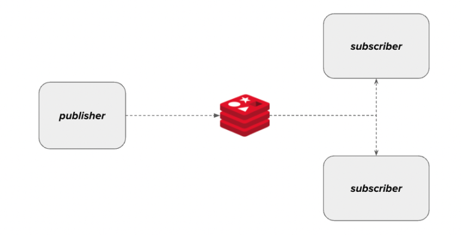

## Reactive Redis pubsub

### Goal

---

> ***Application***  

>> ***Publisher Application***: Periodically publish Jokes  

>> ***Subscriber Application***: print joke  

> But Jokes!!!

>> ***Jokes API***: Getting This URL `https://v2.jokeapi.dev/joke/Any?type=twopart` generate random joke. Response payload is:

```javascript
{
    "error": false,
    "category": "Christmas",
    "type": "twopart",
    "setup": "What do Santa's little helpers learn at school?",
    "delivery": "The elf-abet!\n",
    "flags": {
        "nsfw": false,
        "religious": false,
        "political": false,
        "racist": false,
        "sexist": false,
        "explicit": false
    },
    "id": 248,
    "safe": true,
    "lang": "en"
}
```
 
### Redis pubsub

---




### Run 

1. Run Redis

```sh
$ docker compose up -d
```

2. Run Publisher

```sh
$ ./mvnw spring-boot:run
```

3. Run Subscriber

```sh
$ ./mvnw spring-boot:run
```

---


